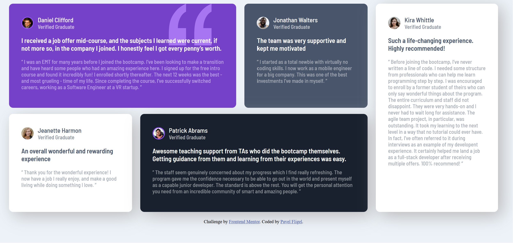

# Frontend Mentor - Testimonials grid section solution

This is a solution to the [Testimonials grid section challenge on Frontend Mentor](https://www.frontendmentor.io/challenges/testimonials-grid-section-Nnw6J7Un7). Frontend Mentor challenges help you improve your coding skills by building realistic projects. 

## Table of contents

- [Frontend Mentor - Testimonials grid section solution](#frontend-mentor---testimonials-grid-section-solution)
  - [Table of contents](#table-of-contents)
  - [Overview](#overview)
    - [The challenge](#the-challenge)
    - [Screenshot](#screenshot)
    - [Links](#links)
  - [My process](#my-process)
    - [Built with](#built-with)
    - [What I learned](#what-i-learned)
  - [Acknowledgments](#acknowledgments)

## Overview

### The challenge

Users should be able to:

- View the optimal layout for the site depending on their device's screen size

### Screenshot

### Links

- Live Site URL: [Add live site URL here](https://your-live-site-url.com)

## My process

### Built with

- Semantic HTML5 markup
- CSS
- Flexbox
- Mobile-first workflow

### What I learned

- HTML
- CSS
- Flexbox
- Javascript
- Responsive web design

## Acknowledgments

 Many thanks to [Zach Gollwitzer](https://www.zachgollwitzer.com/) for his comprehensive online course on ["Frontend Web Development Bootcamp Course (JavaScript, HTML, CSS)"](https://youtu.be/zJSY8tbf_ys?feature=shared) on YouTube. His clear explanations and practical examples have greatly enhanced my understanding of frontend web development. The hands-on projects and coding challenges were particularly helpful in applying the learned concepts. I highly recommend this course to anyone interested in learning frontend web development.